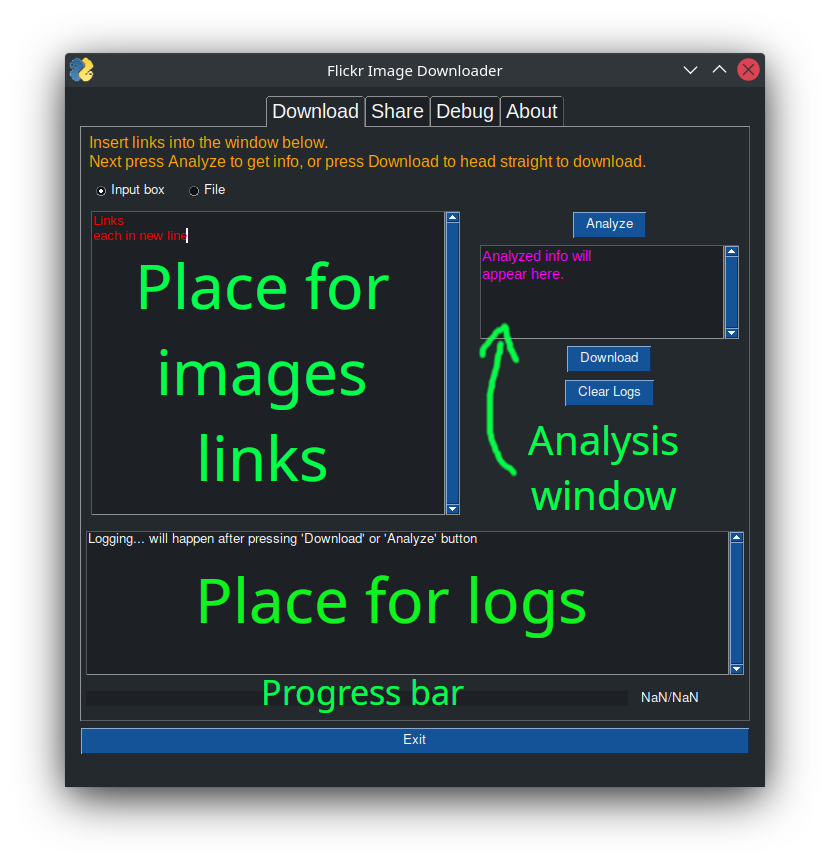
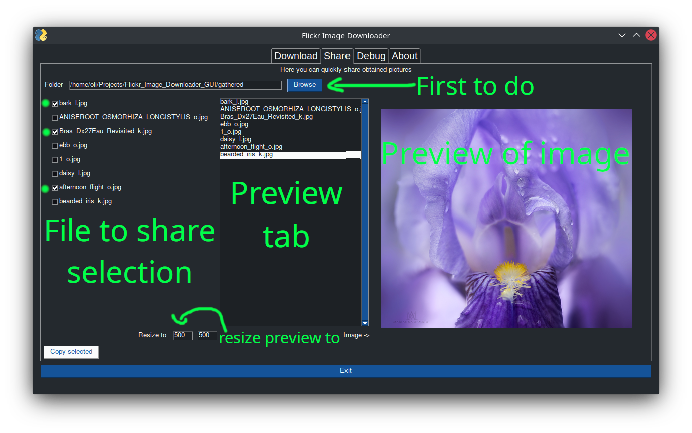

<div style="text-align:center">

# __Flickr Image Downloader GUI__

</div>
GUI app for downloading beautiful images in full glory from [Flickr](https://www.flickr.com/)!


For the CLI version, head over to: https://github.com/Exmantion/Flickr-Image-Downloader


# 0. DISCLAIMER
This tool is meant for __personal use only__. The goal of this tool was to obtain images in high resolution - the same ones which can be viewed on the Flickr site. This tool does not allow the download of original files if the owner of them did not add such an option on the Flickr site. It is meant only as an alternative for making screenshots of a webpage just to have a wallpaper in good quality. This tool, in a nutshell, does the same thing as going into Chromium Developer tools > Network > Filtering by Img and downloading the image which will be displayed on the list.

</br>

# 1. Features

Some of the key features include:
 - Easy download with one click;
 - Downloading with the use of links to the images;
 - Sharing tab which allows viewing and sharing direct links to selected images;
 - Source links can be pasted or placed in a file;
 - Python based;
 - Fully opens-source;
 - more to come which may be considered as a feature?

</br>

# 2. Installation 
How to get things up and running

## From `.py` file

_App made with [PySimpleGUI](https://www.pysimplegui.org/en/latest/)_

You can grab the `.py` file and run it yourself by executing the 

`python3 Flickr_Image_Downloader_GUI.py`

script. Several libraries are required to be installed:

```
import requests
import os 
from datetime import datetime
import re
import PySimpleGUI
import PIL.Image
import io
import base64
import pyperclip
import time
```

If some are not installed, install them with:

`pip3 install PySimpleGUI`

## From compiled single executable
This method does not require any additional software to be installed on your machine. Just double-click the executable or `./file` in the terminal (Linux only). You may need to

`chmod +x file` 
 
 to be able to do so.

Executable created with: [pyinstaller](https://pyinstaller.org/en/stable/)

`pyinstaller flicr_gui.py --onefile`

</br>

# 3. Usage
How to use the app.

## What links are accepted
At first, it is required to have links to the photos. They can be of the form as below:
```
https://www.flickr.com/photos/wernerkrause/52427331246/sizes/l/
https://www.flickr.com/photos/wernerkrause/52427331246/
https://www.flickr.com/photos/wernerkrause/52427331246
https://www.flickr.com/photos/steffe/52491777467/in/contacts/
```
Example and random photos.
The app allows an option to download multiple photos. 

    HINT: To easily copy several links to images, you can open each photo in a separate web browser tab. Then, click on the first one. While holding the `Shift` key click on the last one. All of the tabs should be selected now. Next, right-click on the selection and select `Copy sites addresses` and then paste them into the input file. Works on the Opera browser, but all of the Chromium-based browsers should have such an option.


## Download tab
After launching the app the following interface will hopefully show up:



- The first two checkboxes switch between sources of images. By default, it will lead to the window below with red text (`Input box`). There you have to paste all the image sources, each in a new line. For good measure, delete the red text beforehand. If you don't, app will become very angry.

- `File` option allows to use `input_urls.txt` file which is taken from the location of the script. The same rules apply: paste all the links, each in a new line. Links from this file will be added to the `Input box` after pressing `Analyze` button.

- `Analyze` button is used to analyze the provided links without starting any download. It will check for duplicates and get rid of them by displaying a proper message. 

- `Download` button starts the download process. Files are saved to the new folder called 'gathered' created in the location of the app executable. 

- `Cleat Logs` button, well that's hard - it clears the log from the Logging window.

- `Place for logs` displays sequential progress of downloading. It will update with each downloaded photo providing some additional feedback on what's going on. 

- `Progress bar` shows the numerical progress just like the counter right next to it.

- `Exit` exit.

## Share tab
The `Share` tab allows sharing of the downloaded files by copying selected image links to the clipboard. 

    NOTE: It does not copy the files, just the direct links to them. You can paste them into Discord chat (or similar messenger) and the embeds should appear (no more than 5 for each message tho (Discord limitation) ).



First of all, click `Browse` button. The pop-up window will appear. By default, it will lead to `gathered` folder in the location of the executable app file. Select it to show all of the images located there. 

The list on the left is for selecting which images will be copied to the clipboard. The middle list (or the right one before selecting) is only for selecting which image to display on the right side of the app. The app displays it in a smaller size which can be adjusted with `Resize` dimensions. 

Sometimes window may not scale up properly and images will not display automatically. In such a case, resize the window manually. 

`Copy Selected` button copies links to the selected images to the clipboard.

    NOTE: Common mistake will be to download images first, close the app, reopen it and then try to share located in the folder images. It does not work like that.
    
    You have to share downloaded images just after downloading them!

## Other tabs are to be implemented 
- Debug for debugging the downloaded images 
- Info which I should've implemented first
- maybe an importer to not loose links of the images upon closing the app
</br>

# 4. Debugging

If you encounter any errors or sudden crashes please write me a message. Additionally, you can also run the app via a terminal and see what exactly is happening since the app `print()` quite a bit of info. 